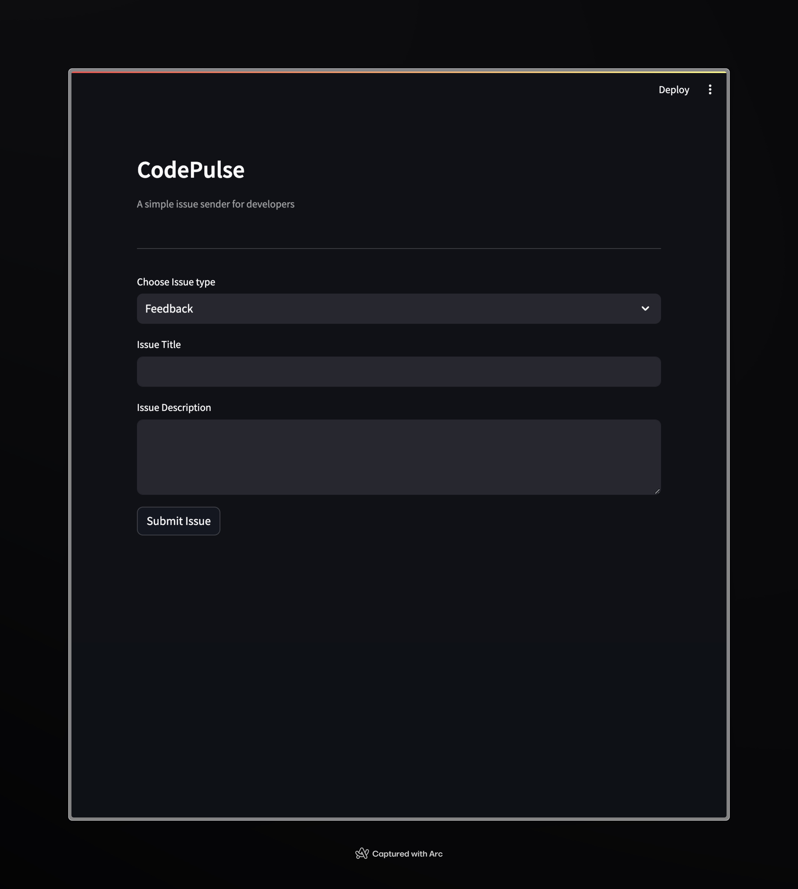

# CodePulse

CodePulse is a simple issue sender for developers to quickly offer issue submission in their platforms.

## Table of Contents
- [Requirements](#requirements)
- [Key Features](#key-features)
- [Usage](#usage)
- [Environment Variables](#environment-variables)
- [Contributing](#contributing)
- [License](#license)

## Requirements

- Python 3.6 or higher
- Install the following dependencies from `requirements.txt`:
  - `python-dotenv~=1.0.1`
  - `requests~=2.31.0`
  - `streamlit~=1.31.1`

## Key Features

- **Customizable Send Methods**: Developers can easily add additional send methods to send issues to different platforms. For example, they can create an `emailSend.py` method inside the services folder and integrate it into `sendIssue.py`.

## Usage

To use CodePulse, follow these steps:

1. Install the required dependencies using `pip install -r requirements.txt`.
2. Set up the required environment variables (If you wish to send the issues to notion):
   - `NOTION_INTEGRATION_TOKEN`: Notion integration token for authentication.
   - `NOTION_DATABASE_ID`: Notion database ID where issues will be sent.
3. Run `codepulse.py`.
4. Choose the issue type from the dropdown menu (Feedback, Bug, Feature Request).
5. Enter the issue title and description.
6. Click the "Submit Issue" button to send the issue.

## Environment Variables

To use CodePulse with Notion, you need to set the following environment variables:

- NOTION_INTEGRATION_TOKEN: Notion integration token for authentication.
- NOTION_DATABASE_ID: Notion database ID where issues will be sent.

## Contributing

Contributions are welcome! Feel free to open issues or pull requests.

## License

This project is licensed under the MIT License.